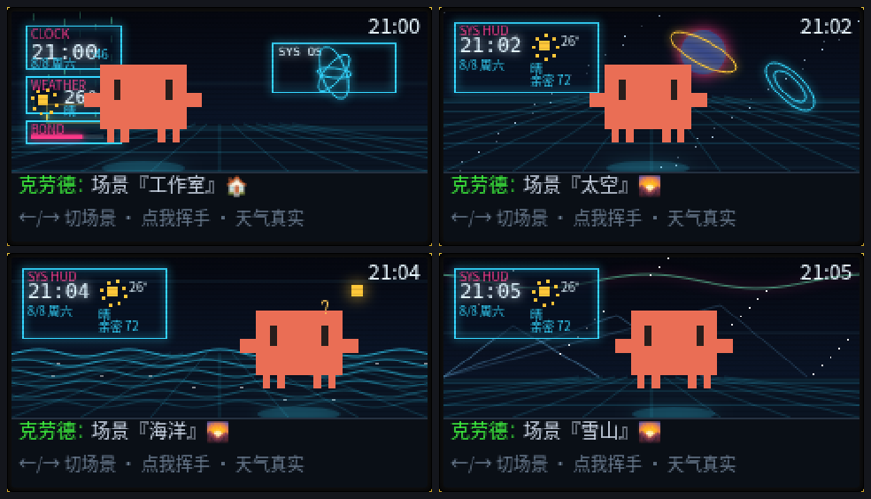

# 克劳德 · Clawd 🦀 — 住在你掌心里的 AI 像素宠物

**一只真正"活着"的 AI 电子宠物，专为 M5Stack Cardputer 打造。** 它会说话、会记住你、会在你空闲时主动来找你、还喜欢被你抚摸。而且它**完全跑在没有 PSRAM 的 ESP32-S3 上**，极致省内存。

**[English](README.md)** · **[中文](README.zh-CN.md)**

---



> 把掌上的 Cardputer 变成一只真的有生命感的宠物 —— 它记得你、理解你的情绪、会回应你的触摸、
> 还会在 10 个场景里过自己的小日子。**零 PSRAM，极致的内存效率。**

---

## ✨ 克劳德为什么不一样

### 🐾 它喜欢被抚摸
克劳德用内置的 **BMI270 加速度计**来"感受"你的动作 —— **不需要任何额外硬件**。
轻轻抚摸它，它会眯眼撒娇"喵~最舒服了"；抱在怀里摇晃，它会困倦入睡；粗暴晃动，它会委屈地"呜…头好晕"。

### 🗣️ 它听你说话
按住 `Opt` 键说话，语音通过 **Azure 语音识别**在设备上实时转成文字，自动填入输入框。按住说话，松开发送。

### 💬 它会主动来找你
克劳德不只是被动回答。它会根据你的聊天记录和记忆，**在你空闲时主动开口**，用轻柔的三连音提醒你 —— 像一只真的想念你的宠物。

### 🧠 真记忆 + 真人格
后端 Node "大脑" 有 **3 层记忆**（短期 + 滚动摘要 + 关于你的长期事实）。克劳德记得你的计划、烦心事、偏好 —— 用温暖、像真人朋友的方式回应。

### 🌍 屏幕上的真实世界
实时时钟/日期（NTP）、**实时天气**（open-meteo 自动定位）、WiFi 信号 —— 还有**你的投资组合行情**（标普 / 纳指 / 上证 / 恒生）、持仓、收益、补仓信号。

### 🎨 10 个昼夜场景
"像素全息工作台"风格 —— 深蓝蓝图网格 + 霓虹辉光 + 清晰像素画。室内场景按作息自动切换，室外场景手动切换。克劳德在里面自由漫步、吃饭、睡觉、工作。

### 🧵 永不卡顿
思考在**第二个 CPU 核心**运行，主循环持续渲染动画 —— 克劳德"思考"时也一直在动。

---

## 🧰 硬件

| 组件 | 说明 |
|------|------|
| **开发板** | M5Stack Cardputer / Cardputer ADV（ESP32-S3FN8，8MB Flash，**无 PSRAM**）|
| **后端** | 同局域网任意电脑运行 Node "大脑" |
| **可选** | microSD（多 app launcher 模式）|

---

## 🚀 快速开始

### 1. 后端（大脑）

```bash
cd backend
cp .env.example .env          # 填上你的 API key
npm install
npm start                     # 运行在 http://0.0.0.0:8787
```

后端默认监听 `0.0.0.0` 且 CORS 全开,所以 `.env` 里的 `PET_TOKEN` **不是可选项** ——
不填的话局域网内任何设备都能读到你宠物的记忆、或盗刷你的 LLM 额度。随便设一个字符串,
然后把**完全相同**的值填进下面固件那步的 `firmware/src/config.h` 的 `PET_TOKEN`,两边必须一致。

### 2. 精灵图

```bash
python tools/gen_sprites.py   # 生成默认像素宠物
python tools/pack_sprites.py  # → 设备格式
```

### 3. 固件

```bash
cd firmware
cp src/config.h.example src/config.h   # 填 WiFi、后端 IP
pio run -t upload            # 编译 + 烧录
pio run -t uploadfs          # 上传精灵到 LittleFS
```

---

## 🎮 操作

| 操作 | 按键 |
|------|------|
| 打字聊天 | 输入 + `Enter` |
| **语音输入** | 按住 `Opt` 说话，松开发送 |
| **抚摸它** | 轻轻摸/摇晃设备（无需按键）|
| 上一个 / 下一个场景 | `Fn` + `[` / `]` |
| 场景跟随作息 | `Fn` + `\` |
| 中 / 英输入 | `Shift`（Aa）|
| 翻译模式 | `Alt` |
| 长回复翻页 | `Fn` + `.` / `,` |
| 播放表情 | `Fn` + `1`…`0` |
| 亮度 | `-` / `=` |

---

## 🏗 架构

```
┌──────────────┐  WiFi/LAN   ┌────────────────────┐   HTTPS   ┌────────────┐
│  Cardputer    │  ────────►  │  backend (Node)    │ ────────► │  LLM       │
│  firmware     │  /chat     │  brain + 3层记忆   │           │ (DeepSeek) │
│ (C++/PIO)     │  ◄────────  │  data/<pet>.json   │           └────────────┘
└──────┬───────┘             └────────────────────┘
       │ 设备直连: Azure STT · open-meteo · Dell Hub(行情)
       ▼
  BMI270 加速度计(抚摸交互) · I2C 独立于语音 I2S
```

- **为什么用后端？** API key 不暴露在设备上，记忆有地方存，换模型只改一处。
- **为什么设备直连？** 语音输入（Azure STT）和天气（open-meteo）从设备干净 WiFi 直达；只有对话大脑走电脑。

---

## 🛠 工程亮点（省内存的硬功夫）

克劳德为 **无 PSRAM 的 ESP32-S3**（约 327KB RAM）而生，下面是让它跑起来的独门技巧：

- **无 PSRAM** —— 单全屏 canvas + 精灵按动作流式加载；TLS 很吃栈，加大 loop 栈 + 思考放第二核心。
- **语音输入不爆内存** —— 双缓冲乒乓录音 + `isRecording()` 等填满 + 流式写 LittleFS，只用约 8KB 静态内存。**首次在无 PSRAM 上稳定实现语音输入。**
- **抚摸交互几乎零内存** —— BMI270 手势检测（抚摸 / 摇晃 / 粗暴），只用约 32 字节静态状态。
- **主动对话几乎零内存** —— 智能逻辑全在后端，固件只做 HTTP 轮询 + 内置 `tone()` 蜂鸣。
- **ES8311 codec** 用 GPIO 复位（不用 I2C Wire，避免死机）；NS4150 功放静音消除电流声。

---

## 📁 仓库结构

```
firmware/     ESP32-S3 固件(PlatformIO)。scenes.h 场景渲染, main.cpp 主程序,
              stt.h 语音输入, pet_touch.h 抚摸交互
backend/      Node/Express "大脑": LLM 对话 + 3层记忆 + 主动对话 + 翻译
sim/          浏览器设备孪生 + 场景预览
tools/        gen_sprites.py(生成像素宠物) + pack_sprites.py(转设备格式)
sprites_src/  默认像素宠物源帧
```

---

## 📜 许可证

[Apache-2.0](LICENSE)。

---

## 🙏 致谢

本项目**改造自 [小豆丁 (xiaodouding)](https://github.com/huaspirit123/xiaodouding) 像素宠物项目**，由 **[@huaspirit123](https://github.com/huaspirit123)** 创作。**衷心感谢原作者**奠定了这个宠物的基础。

同时感谢用到的技术：LLM — [DeepSeek](https://deepseek.com)（可换任意 OpenAI 兼容端点）· 语音输入 — [Azure Speech](https://azure.microsoft.com/products/ai-services/ai-speech/) · 天气 — [open-meteo](https://open-meteo.com) · 硬件 — [M5Stack Cardputer](https://m5stack.com)。

> 与上述公司无关联，请自带 API key。
